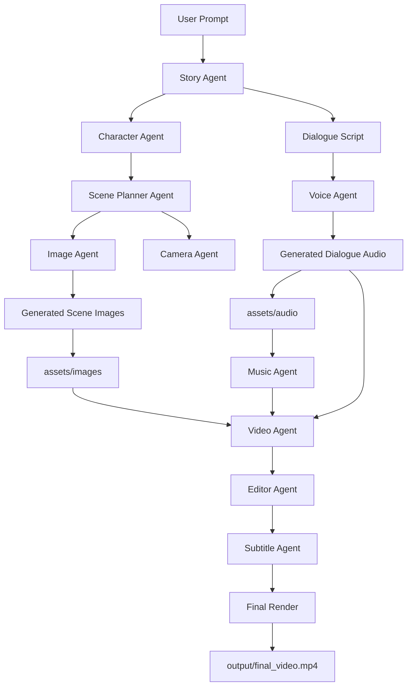

# Multi-Agent AI Short Drama Generation System

This project explores how a coordinated set of AI agents can collaborate to generate a short cinematic drama.
Instead of relying on a single monolithic model, the system divides the creative pipeline into specialised agents responsible for story development, character consistency, scene planning, visual generation, voice synthesis, and final video composition.

The result is a short 720p drama generated through a structured workflow that combines **text, images, voice, music, and video editing** into a single automated pipeline.

This project was developed as part of a technical assessment.

---

# Demo

The generated drama video is included directly in the repository.

```
output/final_video.mp4
```

The video is produced automatically by the pipeline after all agents complete their tasks.

Generated visual scenes and dialogue audio files used during production are also included in the repository for transparency and inspection:

```
assets/images
assets/audio
```


These assets represent intermediate outputs produced by the agents during the generation pipeline. The final video is assembled from the generated scenes, dialogue audio, and background music through the video composition stage.

---

# System Overview

The goal of the system is to simulate a small creative production pipeline powered by AI agents.

Each agent has a clearly defined responsibility and produces structured outputs that are consumed by the next stage of the pipeline.

The workflow converts a simple prompt into a short video through the following steps:

1. Story generation
2. Character creation
3. Scene planning
4. Image generation
5. Dialogue voice synthesis
6. Background music integration
7. Video composition
8. Subtitle generation

The orchestration layer coordinates these agents and ensures the outputs flow through the pipeline correctly.

---

# Architecture

The system is organised around independent agents located in the `agents/` directory.
Each agent focuses on a specific stage of the production pipeline.

Pipeline flow:

User Prompt
→ Story Agent
→ Character Agent
→ Scene Planner Agent
→ Image Generation
→ Voice Generation
→ Music Integration
→ Video Assembly
→ Subtitle Generation
→ Final Rendered Drama

The pipeline is orchestrated by a central controller which manages execution order and data exchange between agents.

---

## System Architecture Diagram



---

# Agent Responsibilities

## Story Agent

Generates the narrative foundation for the drama.

Responsibilities:

* create the overall plot
* generate dialogue
* define scene context

Output:

* structured story data used by downstream agents.

---

## Character Agent

Builds consistent character profiles used throughout the story.

Responsibilities:

* define character attributes
* establish personality traits
* maintain character consistency across scenes

Output:

* structured character descriptions.

---

## Scene Planner Agent

Transforms the narrative into a structured storyboard.

Responsibilities:

* break the story into scenes
* define scene settings
* determine which characters appear in each scene
* prepare prompts for image generation

Output:

* scene sequence and storyboard structure.

---

## Image Agent

Generates visual content for each scene.

Responsibilities:

* generate images based on scene descriptions
* maintain visual consistency between scenes

Image generation is performed using models provided by Stability AI, translating structured scene prompts into cinematic visual frames.

Images are stored in:

```
assets/images
```

Example generated outputs include:

```
scene1_shot1.png
scene1_shot2.png
```

Each image represents a visual shot generated from the scene descriptions produced by the Scene Planner Agent.

---

## Voice Agent

Generates dialogue narration for characters.

Speech synthesis is implemented using **Edge TTS**.

Each line of dialogue is converted into an individual audio file and stored in:

```
assets/audio
```

Example generated files:

```
line_1.mp3
line_2.mp3
...
```

These files represent spoken dialogue generated from the script.
They can be synchronised with scenes during the video composition stage.

---

## Music Agent

Adds background music to the final composition to improve pacing and atmosphere.

Music files are located in:

```
assets/music
```

Example:

```
background.mp3
```

---

## Camera Agent

Adds cinematic structure to the scenes.

Responsibilities:

* determine scene framing
* provide camera movement guidance
* define pacing for scene transitions

---

## Subtitle Agent

Generates subtitles aligned with the spoken dialogue.

Responsibilities:

* convert dialogue into subtitle format
* synchronise subtitles with narration

---

## Video Agent

Combines visual assets, voice narration, subtitles, and background music to produce the final video.

This stage handles:

* scene assembly
* audio synchronisation
* final rendering

Output video:

```
output/final_video.mp4
```

---

## Editor Agent

Responsible for final post-processing.

Tasks include:

* scene ordering
* subtitle placement
* audio balancing
* exporting the final video

---

# Prompt Engineering

The system relies on structured prompts stored in the `prompts/` directory.

```
prompts/
    camera_prompt
    character_prompt
    scene_prompt
    story_prompt
```

Each prompt template provides instructions to the language model to ensure consistent structured outputs across agents.

This structured approach ensures that downstream agents receive predictable data formats, enabling reliable automation across the pipeline.

---

# LLM Integration

All language model interactions are handled through:

```
utils/llm.py
```

The current implementation uses:

**Gemini 2.5 Flash**

The model is used for:

* story generation
* character generation
* scene planning
* prompt refinement

---

# Workflow Orchestration

The pipeline execution is coordinated by:

```
workflows/orchestrator.py
```

This file acts as the central controller and executes each stage of the pipeline sequentially.

Core pipeline steps:

1. generate_story
2. generate_characters
3. generate_storyboard
4. generate_images
5. generate_dialogue_audio
6. build_video

Running the orchestrator executes the full production workflow.

---

# Project Structure

```
agents/
    camera_agent.py
    character_agent.py
    editor_agent.py
    image_agent.py
    music_agent.py
    scene_planner_agent.py
    story_agent.py
    subtitle_agent.py
    video_agent.py
    voice_agent.py

assets/
    audio/
        line_1.mp3
        line_2.mp3
        ...
    images/
        scene1_shot1.png
        scene1_shot2.png
        scene1_shot3.png
        scene1_shot4.png
    music/
        background.mp3

backend/
    server.py

prompts/
    camera_prompt
    character_prompt
    scene_prompt
    story_prompt

utils/
    file_utils.py
    llm.py

workflows/
    orchestrator.py

output/
    final_video.mp4

.env
requirements.txt
README.md
```

---

# Generated Outputs

The system produces several intermediate artefacts during execution.

Audio dialogue files:

```
assets/audio/line_*.mp3
```

Generated visual scenes:

```
assets/images/scene*_shot*.png
```

Final rendered drama:

```
output/final_video.mp4
```

These artefacts demonstrate the intermediate stages of the multi-agent generation pipeline.

---

# Running the System

Install dependencies:

```
pip install -r requirements.txt
```
Environment Variables

Create a `.env` file in the project root directory and add the required API keys:

.env

GEMINI_API_KEY=your_gemini_api_key
STABILITY_API_KEY=your_stability_api_key

The system uses:

- Gemini 2.5 Flash for story generation, character design, and scene planning.
- Stability AI for cinematic image generation.

Then run the pipeline:

```
python workflows/orchestrator.py
```

After the pipeline completes, the generated video will appear in:

```
output/final_video.mp4
```

---

# Technologies Used

Python
Gemini 2.5 Flash
Edge TTS
MoviePy
FastAPI
Stability AI (image generation)
FFmpeg-based video processing

---

# Notes

The system is designed as a modular architecture where individual agents can be extended or replaced with different models or tools without modifying the entire pipeline.

Future improvements could include stronger character consistency models, more advanced scene composition, and parallel agent execution.
